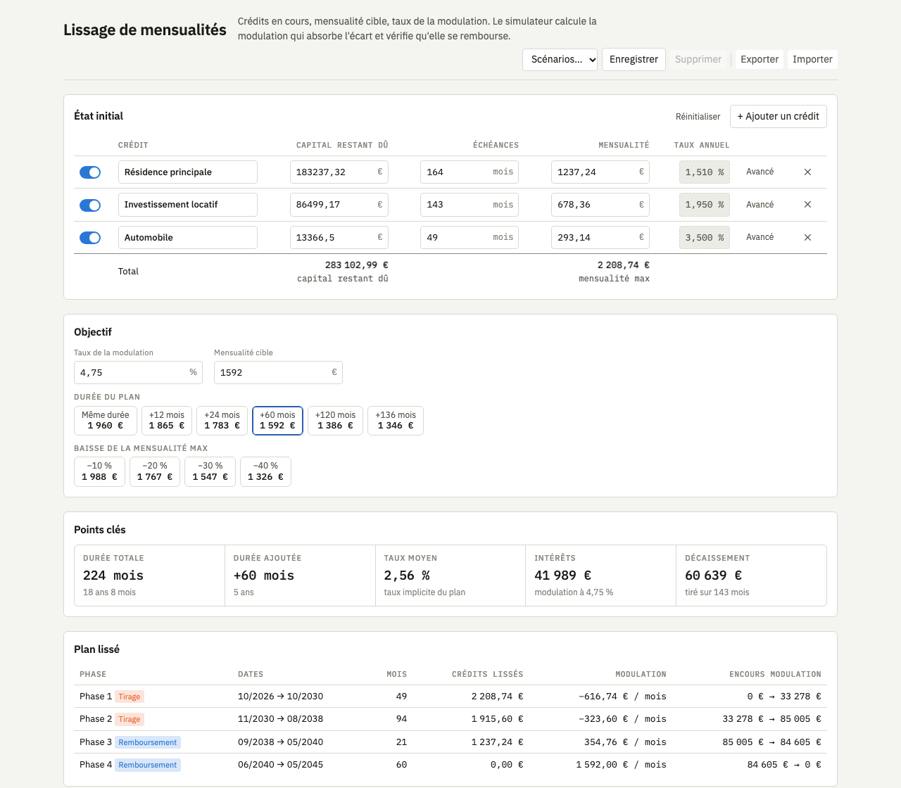

# Loan Payment Smoothing Simulator

[](https://github.com/Plokkke/loan-smoothing-simulator/actions/workflows/ci.yml)
[](LICENSE)

**[Live demo →](https://plokkke.github.io/loan-smoothing-simulator/)** (UI in French)

A borrower juggling several loans pays a monthly total that jumps every time a loan starts or ends
(e.g. 2 209 € for four years, then 1 916 €, then 1 237 €). This simulator flattens that curve: given the running
loans and a **target monthly payment**, it computes the revolving credit line that absorbs the
difference — drawing on it while the loans cost more than the target, repaying it once they cost
less — and checks that the whole structure actually gets repaid.



## Highlights

- **Pure, tested computation engine** (`engine.js`): no DOM, runs in the browser and in Node.
- **Exact money arithmetic**: every booked amount is an integer number of cents (see
  [Money and rounding](#money-and-rounding)), verified by property-based tests.
- **Rate inference**: from the three figures printed on any loan statement (outstanding capital,
  remaining instalments, monthly payment), the annual rate is recovered by bisection.
- **Month-by-month simulation** of the credit line with capitalised interest, detection of
  infeasible plans (target below the line's interest, or not repaid within 50 years).
- **Solvers**: minimum repayable target, target keeping the original duration, target for any
  given duration — all by monotone bisection on the simulation.
- **Effective rate** of the whole smoothed plan, computed as the IRR of its cash flows: what a
  lender would actually underwrite.
- **Advanced loans**: explicit rate, deferred start, stepped schedules, balloon or continued
  closing payment.
- Named scenarios, JSON export/import, `localStorage` persistence. Zero runtime dependencies, no
  build step.

## Run

```sh
npm start   # python3 -m http.server 8765, then open http://localhost:8765
```

Opening `index.html` directly also works. Append `?nostore` to disable persistence.

## Test

```sh
npm install
npm test
```

- `test/engine.test.js`: worked examples.
- `test/engine.property.test.js`: invariants checked with [fast-check](https://fast-check.dev) on
  randomly generated loans and plans — the capital is repaid to the exact cent, every cent paid is
  either capital or interest, a feasible plan always clears the line, the minimum target is exact
  to the cent. They already caught a real bug: the annuity formula divided by zero for
  vanishingly small rates, now computed with `log1p`/`expm1`.

## Model

- One rate convention everywhere: annual rates are nominal (French *taux débiteur*), applied
  proportionally, monthly rate = annual rate / 12. This holds for the loans, the credit line and
  the plan's effective rate, so they compare directly. A TAEG, which compounds monthly and
  includes fees and insurance, is a different quantity and should not be entered as a rate.
- Each month the borrower pays the target `T`. The credit line receives `T − Σ loan payments`:
  negative means a draw, capitalised with interest; positive means a repayment (the line's capital
  only decreases once the payment exceeds the month's interest).
- A loan can be excluded from the smoothing: it is still paid, on top of the target.
- The plan is infeasible if, once every loan is repaid, `T` does not cover the line's interest, or
  if the line is not cleared within 600 months.

## Money and rounding

Floating-point euros drift silently over hundreds of months, so the engine separates two worlds:

- **Booked amounts are integer cents.** Inputs are converted once at the boundary
  (`fromEuros`); balances, payments, interest and line flows never leave integers.
- **Interest is rounded half-up to the cent, once per month**, exactly where a bank would book it.
  Principal is then `payment − interest`, so nothing is ever lost or created.
- **The last instalment is an adjusting instalment**: a leftover below 0.50 € (from a rate
  rounded on a statement, or accumulated interest rounding) is folded into it rather than
  producing a phantom month.
- **Rates, solvers and IRR stay floating point**: they are numerical methods, never booked. The
  target solvers bisect directly on integer cents, so their results are exact.

## Layout

| File | Role |
| --- | --- |
| `engine.js` | Pure computation: schedules, simulation, solvers |
| `format.js`, `charts.js`, `render.js` | Formatting, SVG charts, results rendering |
| `loan-dialog.js` | Advanced loan editor |
| `presets.js` | Named scenarios, JSON export/import |
| `app.js` | State, loans table, persistence |

## License

[MIT](LICENSE)
